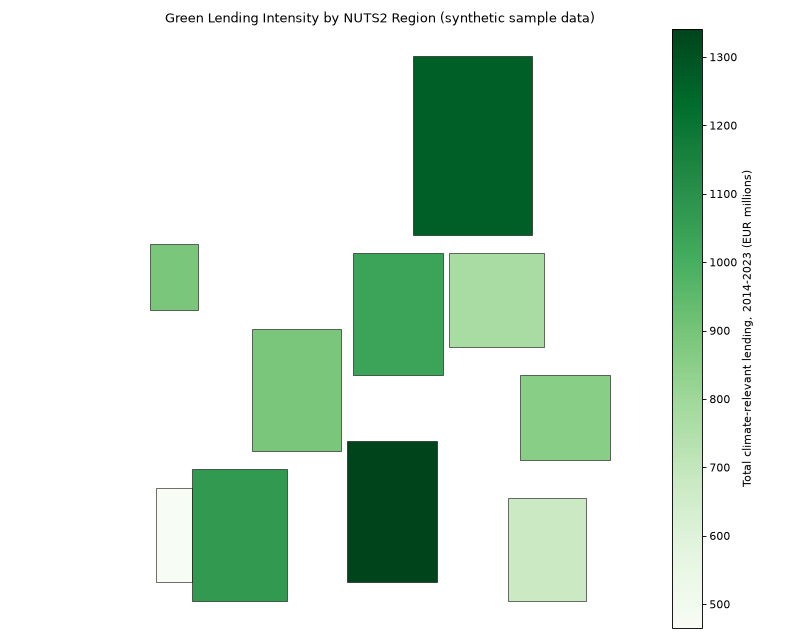
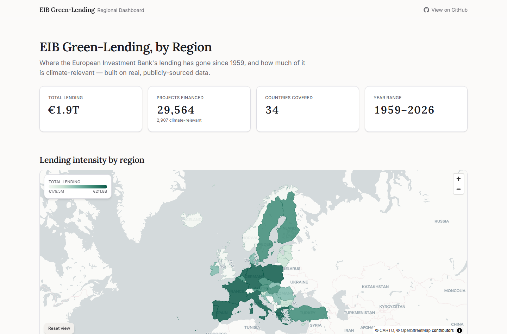

# EIB Green-Lending Regional Pipeline

A small, reproducible Python pipeline that reproduces a regional green-finance data workflow:
it takes European Investment Bank (EIB) green-lending project data, extracts key figures from
project appraisal PDFs, assigns each investment a region, merges it with a Eurostat regional
economic indicator, and produces a choropleth map plus a saved, analysis-ready regional panel
dataset. It was built as a portfolio demonstrator of data-construction and geospatial-linkage
skills relevant to green public finance and regional economic development research.

> **Built with AI assistance — human in the loop.** This repository was built with the help of
> Claude (Anthropic) as a quick demo / proof-of-concept, not production-grade research code.
> Every stage was directed and reviewed by a human; design decisions, data choices and
> interpretations are my own. It has not been through the level of review, testing or scrutiny
> expected of a published research pipeline.

**This pipeline runs in two modes.** The default **real** mode uses live open data from the
European Investment Bank, Eurostat GISCO (NUTS 2021), and Eurostat regional accounts. The
**sample** mode uses a small generated dataset with the same schema and requires no downloads.
No statistical "findings" are claimed anywhere in this repository; every figure is either a
plain descriptive aggregate of real data, or clearly labelled synthetic/illustrative.



## Interactive dashboard

**Live: [PLACEHOLDER - (https://v0.app/nipunkalra198-9022/chat/eib-green-lending-by-region-lBdN5uzURu2)]**

A Next.js dashboard sits on top of this pipeline's output - an interactive choropleth (hover
for stats, click a region for a detail panel with a sector breakdown), supporting charts, a
top-10 regions table, and the same Known Limitations shown below. It's a pure static frontend:
no backend, no API routes, just two JSON/GeoJSON files exported by
`src/export_frontend_data.py`. See [frontend/README.md](frontend/README.md) for local dev and
deploy instructions.



## What this demonstrates

- **Dataset construction from heterogeneous sources** - combining a project-level export with
  figures extracted from PDF documents into a single analysis-ready table.
- **PDF extraction** - regex-based extraction of financial variables from project PDFs using
  `pdfplumber`, adapted honestly to what each document type actually contains (see
  [Known limitations](#known-limitations)).
- **Geographic identifier assignment** - a genuine point-in-polygon spatial join with
  `geopandas` in sample mode (NUTS2/NUTS3, explicit EPSG:4326 CRS handling); a country-level
  attribute join in real mode, because the public EIB export has no project coordinates.
- **Merging on regional keys** - aggregating project-level data to a region-by-year panel and
  joining it onto a regional economic indicator by region code and year.
- **Visualisation** - a choropleth of regional lending intensity, plus sector and time-series
  breakdowns.

## Data sources

| Source | What it provides | URL |
|---|---|---|
| EIB financed-projects list | Project-level records: name, country, sector, signature date, signed amount | [eib.org/en/projects/loans/index.htm](https://www.eib.org/en/projects/loans/index.htm) (manual "Export to Excel" - no static download URL exists) |
| EIB project appraisal PDFs | "Environmental and Social Data Sheet" documents for individual projects | `eib.org/attachments/registers/*.pdf` (see [Reproducibility](#reproducibility) for exact URLs used) |
| Eurostat GISCO - NUTS 2021 boundaries | NUTS2/NUTS3 boundary geometries (GeoJSON, EPSG:4326) | [Nuts2json](https://github.com/eurostat/Nuts2json) distribution |
| Eurostat regional accounts | Regional GDP, `nama_10r_2gdp` (NUTS2, current prices, MIO_EUR) | fetched via the [`eurostat`](https://pypi.org/project/eurostat/) Python package |

## How to run

Requires Python 3.11+ and no Conda (plain `venv` + `pip`).

```bash
python -m venv .venv

# Windows
.venv\Scripts\activate
# macOS / Linux
source .venv/bin/activate

pip install -r requirements.txt
```

**Sample mode** (zero downloads, runs immediately):

```bash
python src/generate_synthetic.py
python src/load_lending.py --mode sample
python src/extract_pdf.py --mode sample
python src/assign_nuts.py --mode sample
python src/merge_regional.py --mode sample
python src/visualise.py --mode sample
```

**Real mode:**

```bash
python src/fetch_real.py
```

This downloads NUTS boundaries, the Eurostat GDP indicator, and 5 sample EIB PDFs
automatically. It **cannot** download the EIB financed-projects list - that export is behind a
JS-driven search UI with no static URL. You'll need to:

1. Open [eib.org/en/projects/loans/index.htm](https://www.eib.org/en/projects/loans/index.htm)
2. Search/filter as you like, then click "Export to Excel"
3. Save the result as `data/real/eib/eib_projects.csv` (despite the extension, this is read as
   a genuine `.xlsx` file - EIB's export format, not actually CSV)

Then run the same five stages with `--mode real` (or omit `--mode` entirely - it auto-detects
real mode once `data/real/` is fully populated).

**Or just run the notebook** (recommended; this is what a reader is most likely to open):

```bash
jupyter notebook notebook.ipynb
```

Set `MODE = "sample"` or `MODE = "real"` in the second cell and run all cells top to bottom.

## Methodology

**Data construction (`load_lending.py`).** Sample mode generates 200 synthetic projects across
10 countries and several sectors with a fixed random seed. Real mode loads a manually-exported
EIB financed-projects list spanning **1959-2026** (the Bank's full lending history) - 29,564
projects after dropping ~3 rows with missing essentials. The real export has no explicit
climate-classification field, so `climate_action` there is a **keyword-derived heuristic** on
the Sector/Description text (matches on "climate", "renewable", "solar", "energy efficiency",
etc.) - not an authoritative EIB tag. `load_lending.py` validates the schema (required columns,
coordinate ranges where present, positive amounts, no duplicate IDs) before anything downstream
touches it.

**PDF extraction (`extract_pdf.py`).** Sample mode extracts three labelled EUR figures (total
project cost, EIB finance, co-financing) from five synthetic PDFs with a fixed format - all
three are always present by construction. Real mode extracts from five real EIB
"Environmental and Social Data Sheet" documents, which are environmental/social compliance
sheets, not financial appraisals: only 1 of 5 mentions a total project cost at all (in
narrative prose, e.g. "total project investment cost of EUR 200m"), and none disclose the
EIB-finance/co-financing split. Real-mode extraction is honestly best-effort - it pulls project
identity fields (always present) and a total cost when mentioned, leaving it `NaN` otherwise.

**Region assignment (`assign_nuts.py`).** Sample mode converts each project's `(lat, lon)` to a
point and performs a genuine `geopandas.sjoin` against a NUTS boundaries file (synthetic
rectangles mirroring real GISCO structure: NUTS2 and NUTS3 in one file via `LEVL_CODE`, NUTS3
codes nesting under their parent NUTS2 code). Real mode **cannot** do this - the public EIB
export has no project coordinates - so it does a country-level attribute join instead: the
project's free-text country name is resolved to an ISO code via `pycountry`, remapped onto
GISCO's country-code convention (which uses "EL" for Greece and "UK" for the United Kingdom,
not ISO's "GR"/"GB"), and matched against the ~37 countries GISCO's NUTS boundaries cover. EIB
lends globally, so about 16% of real projects (development finance in Africa, Asia, Latin
America, etc.) fall outside NUTS coverage and are reported as unmatched, not guessed.

**Regional merge (`merge_regional.py`).** Project-level lending is aggregated to a region x
year panel, then left-joined onto a regional indicator so every region-year is retained,
including ones with no recorded lending. Sample mode's indicator is a synthetic
gross-fixed-capital-formation-style series at NUTS2. Real mode uses Eurostat's `nama_10r_2gdp`
(regional GDP, NUTS2, current prices, MIO_EUR), summed up to country level to match real
mode's coarser geography.

**Visualisation (`visualise.py`).** Three plots: a choropleth of total climate-relevant lending
(by NUTS2 in sample mode, by country in real mode - NUTS2 polygons dissolved to national
boundaries), a bar chart of total lending by sector, and a line chart of lending over time (all
sectors vs. climate-relevant only).

## Reproducibility

Real-mode files were fetched on **2026-07-09** from:

- NUTS2 boundaries: `https://raw.githubusercontent.com/eurostat/Nuts2json/master/pub/v2/2021/4326/20M/nutsrg_2.json`
- NUTS3 boundaries: `https://raw.githubusercontent.com/eurostat/Nuts2json/master/pub/v2/2021/4326/20M/nutsrg_3.json`
- Regional GDP: `eurostat.get_data_df("nama_10r_2gdp")` via the `eurostat` Python package
- 5 EIB project PDFs:
  - `https://www.eib.org/attachments/registers/222930995.pdf` (ENPAL REPOWEREU RENEWABLE ENERGY, Germany)
  - `https://www.eib.org/attachments/registers/169004943.pdf` (AGRIA FOOD PRODUCTION CAPACITY, Bulgaria)
  - `https://www.eib.org/attachments/registers/246665048.pdf` (NORDLB RENEWABLE ENERGY 2, Germany/Regional EU)
  - `https://www.eib.org/attachments/registers/213872807.pdf` (SOLOMON SOLAR PV, Italy)
  - `https://www.eib.org/attachments/registers/142353117.pdf` (EDUCATION MONTPELLIER, France)
- EIB financed-projects list: manually exported from `eib.org/en/projects/loans/index.htm`
  ("Export to Excel", unfiltered) on 2026-07-09. This one can't be re-fetched by script - see
  [How to run](#how-to-run).

Re-running `python src/fetch_real.py` re-downloads everything except the EIB list (idempotent -
add `--force` to re-download files that already exist). Since EIB's register is a live, growing
dataset, a re-export will not be byte-identical to the one used here, but will have the same
schema.

## Repository structure

```
eib-green-lending/
├── src/
│   ├── config.py                # mode resolution (sample/real) and path constants
│   ├── generate_synthetic.py    # seeded synthetic data generator (lending, NUTS, regional, PDFs)
│   ├── fetch_real.py            # downloads real GISCO/Eurostat/EIB-PDF data into data/real/
│   ├── load_lending.py          # load + validate lending data (real: maps EIB export schema)
│   ├── extract_pdf.py           # pdfplumber extraction from project PDFs
│   ├── assign_nuts.py           # NUTS spatial join (sample) / country attribute join (real)
│   ├── merge_regional.py        # region-by-year panel + regional indicator merge
│   ├── visualise.py             # choropleth, sector, and time-series charts (matplotlib)
│   └── export_frontend_data.py  # exports nuts_lending.geojson + summary.json for frontend/
├── data/
│   ├── sample/                  # synthetic sample data (generated, not hand-written)
│   └── real/                    # real data (gitignored) - eib/, gisco/, eurostat/
├── outputs/                     # generated PNGs + merged_panel.csv (gitignored except the README preview image)
├── frontend/                    # Next.js dashboard - static frontend, reads frontend/public/data/ only
├── notebook.ipynb               # narrative walkthrough of the full pipeline (MODE toggle)
├── requirements.txt
└── README.md
```

## Known limitations

- **Real mode is country-level, not NUTS2/NUTS3.** The public EIB financed-projects export has
  no project-level coordinates (nor city, nor a project ID) - only a free-text country name.
  Sample mode demonstrates the full point-in-polygon NUTS2/NUTS3 spatial join on synthetic
  coordinates with the correct schema; real mode's regional linkage is necessarily coarser.
- **`climate_action` in real mode is a keyword heuristic**, not an official EIB classification.
  EIB's public search export doesn't expose its internal Climate Action tagging.
- **Real PDF extraction is sparse by design, not by bug.** EIB's public "Environmental and
  Social Data Sheet" documents are environmental/social compliance sheets, not financial
  appraisals; in the 5 documents used here, only 1 mentions a total project cost, and none
  disclose the EIB-finance/co-financing split.
- **EIB lends globally; NUTS only covers ~37 European countries.** About 16% of real projects
  fall outside GISCO's NUTS coverage and are reported as unmatched rather than guessed.
- **NUTS vintage:** Eurostat's `nama_10r_2gdp` geo codes matched cleanly against GISCO's NUTS
  2021 codes in this run (no unmatched-name warning was raised) - but `merge_regional.py`
  checks this explicitly on every run and will print a warning rather than silently patching
  a mismatch with an invented crosswalk if a future re-fetch does disagree.
- No causal inference or econometric modelling (e.g. difference-in-differences, event-study)
  is included. This repository's scope is data construction and descriptive visualisation.
- The synthetic sample data (200 projects, 5 PDFs, 10 fake rectangular regions) is small by
  design - enough to exercise every stage of the pipeline, not to represent real scale.

## Acknowledgements

Built rapidly with AI coding assistance (Claude Code); design decisions, data choices, and
interpretations are my own.

## License

MIT - see [LICENSE](LICENSE).
